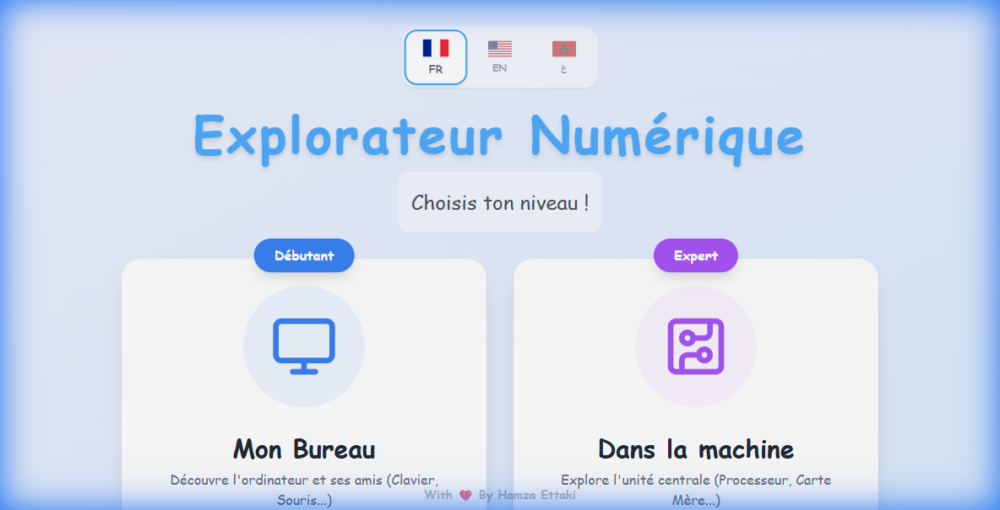

<div align="center">

</div>

# 🖥️ Explorateur Numérique - Computer Device

**Explorateur Numérique** est une application web éducative conçue pour les élèves du primaire. Elle permet de découvrir et d'apprendre les noms des composants essentiels d'un ordinateur de manière interactive et ludique.

🌍 **Multilingue** : Entièrement disponible en **Français 🇫🇷**, **Anglais 🇺🇸** et **Arabe 🇲🇦**.

---

## ✨ Fonctionnalités

### 📖 Apprentissage (Learn Mode)
Une interface visuelle où chaque composant est présenté avec son nom, une description simple et des anecdotes amusantes.

### 🖼️ Vue Bureau (Desk View)
Une exploration spatiale d'un bureau virtuel ! Cliquez sur les équipements (écran, clavier, souris, unité centrale, haut-parleurs, imprimante) pour entendre leur nom et voir s'afficher l'étiquette correspondante.

### 🎮 Jeux (Play Mode)
- **Cherche et Trouve** : Un défi de rapidité pour identifier les composants nommés. Les icônes se mélangent après chaque bonne réponse !
- **Jeu de Mémoire** : Pour associer les paires d'équipements tout en écoutant leur prononciation.
- **Mots Mêlés** : Une grille interactive pour retrouver le vocabulaire informatique.
- **Sauve le Robot** : Une version bienveillante du pendu où il faut aider un robot à garder sa batterie en devinant les lettres !

---

## 🛠️ Stack Technique

- **Framework** : [React.js](https://reactjs.org/) avec [Vite](https://vitejs.dev/)
- **Styling** : [Tailwind CSS](https://tailwindcss.com/) pour une interface moderne et responsive.
- **Icons** : [Lucide React](https://lucide.dev/)
- **Audio** : [ElevenLabs](https://elevenlabs.io/) pour une synthèse vocale de haute qualité dans les trois langues.
- **Développement** : "Vibe coded" avec l'aide de **AI Studio** et **Antigravity (Google)**.
- **Hébergement** : Déployé sur **Vercel**.

---

## 🚀 Installation Locale

### Prérequis
- [Node.js](https://nodejs.org/) (v16+)

### Étapes
1. **Cloner le projet**
   ```bash
   git clone https://github.com/ettakihamza-ma/computer-parts.git
   cd computer-parts
   ```

2. **Installer les dépendances**
   ```bash
   npm install
   ```

3. **Lancer le serveur de développement**
   ```bash
   npm run dev
   ```

4. **Accéder à l'application**
   Ouvrez votre navigateur sur `http://localhost:3000`.

---

## 🤝 Contribution
Ce projet est open-source. N'hésitez pas à proposer des améliorations, des nouveaux jeux ou des corrections de traduction via des Pull Requests !

---

## 📝 Historique des Versions

### Version 1.3 (12/02/2026)
**Corrections et Améliorations :**
- 🐛 **Correctif Mots Mêlés (critique)** : La sélection de lettres s'accumulait indéfiniment et bloquait la validation des mots. La sélection se réinitialise maintenant automatiquement quand elle devient incohérente.
- 🔴 **Feedback visuel Mots Mêlés** : Ajout d'un flash rouge + shake quand une sélection ne correspond à aucun mot, au lieu de ne rien afficher.
- ✨ **Animation Mots Mêlés** : Suppression de l'animation `pulse` infinie sur les lettres trouvées (fatigue visuelle).
- 🔀 **Mélange Cherche et Trouve** : Les icônes sont mélangées au début du jeu et après chaque bonne réponse avec une animation fluide, empêchant la mémorisation des positions.
- 🔊 **Son bonne réponse** : Ajout de l'audio `good_answer` dans le jeu Cherche et Trouve.
- 🖥️ **Icône Unité Centrale** : Remplacement du cube générique (`Box`) par l'icône `PcCase` représentant une vraie tour d'ordinateur.
- 📝 **Mots Mêlés — Imprimante** : Ajout d'un `wordSearchName` court ("Imprime") pour éviter que le mot "IMPRIMANTE" (10 lettres) ne rentre pas dans la grille.

### Version 1.2 (10/02/2026)
**Nouveautés et Améliorations :**
- 🕒 **Timers de Jeu** : Ajout d'un chronomètre en temps réel pour les jeux "Mots Mêlés", "Mémoire" et "Sauve le Robot", avec affichage du temps final en cas de victoire.
- 🏷️ **Nouveau Titre** : L'application s'appelle désormais officiellement **"Explorateur Numérique"**.
- 🎨 **Icônes Mises à Jour** :
    - **RAM** : Nouvelle icône "Barrette Mémoire" pour plus de réalisme (au lieu de la calculatrice).
    - **Carte Graphique** : Nouvelle icône "Image" pour symboliser le traitement graphique.
- 🐛 **Correctifs Mots Mêlés** :
    - Support complet des noms arabes avec normalisation (suppression des hamzas pour la grille).
    - Ajustement des noms trop longs pour s'adapter à la grille 10x10.
    - Alignement correct de la liste de mots en Arabe (RTL).

### Version 1.1 (09/02/2026)
**Améliorations du support de la langue arabe :**
- ✅ Ajout des lettres arabes manquantes (ة, أ, ئ, etc.) dans les jeux
- ✅ Correction de l'affichage RTL (droite à gauche) pour les mots arabes
- ✅ Correction du bug de normalisation des caractères arabes
- ✅ Amélioration du jeu "Mots Mêlés" : possibilité de cliquer les lettres dans n'importe quel ordre
- ✅ Séparation de la logique de normalisation pour les scripts arabes et latins

---

## ❤️ Crédits
Développé avec passion par **Hamza Ettaki**.  
Retrouvez-moi sur LinkedIn : [linkedin.com/in/ettaki/](https://www.linkedin.com/in/ettaki/)

---
*Ce projet a été réalisé en utilisant des outils d'IA générative pour accélérer le développement et la création de contenu (Vibe Coding).*
